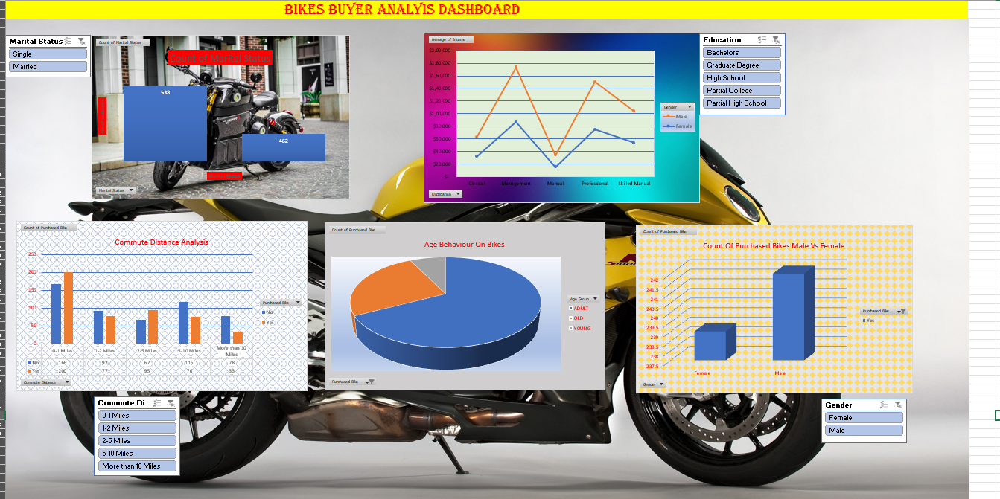

# 🚲 Bikes Buyer Analysis Dashboard

An interactive data visualization dashboard designed to analyze customer purchasing patterns, demographics, and behavioral insights for bike buyers.

This dashboard helps uncover trends related to income, commute distance, age groups, gender distribution, and marital status, enabling data-driven decision making.

---

## 📊 Dashboard Overview

The Bikes Buyer Analysis Dashboard provides a visual breakdown of buyer characteristics and purchase behavior.

Key analyses included:

- Marital Status Distribution
- Income vs Gender Comparison
- Commute Distance Analysis
- Age Behavior on Bike Purchases
- Male vs Female Purchase Comparison
- Education Level Filters

---

## ✨ Features

✔ Interactive visualizations  
✔ Demographic-based filtering  
✔ Buyer behavior insights  
✔ Clean and intuitive layout  
✔ Business-friendly analytics  

---

## 🧩 Insights Captured

The dashboard allows exploration of:

- How income varies across genders
- Which age groups purchase bikes the most
- Impact of commute distance on purchase decisions
- Gender-based purchase differences
- Education level influence on buyers

---

## 🛠️ Tech Stack

This project can be built using tools such as:

- Microsoft Excel / Power BI / Tableau *(update based on your implementation)*
- Data Visualization Techniques
- Pivot Tables / Charts / Slicers

---

## 📁 Dataset

Typical dataset fields used:

- Age  
- Gender  
- Income  
- Marital Status  
- Education  
- Commute Distance  
- Purchased Bike (Yes/No)

---

## 🖼️ Dashboard Preview

*Replace `dashboard_screenshot.png` with your actual image file name.*

---

## 🚀 How to Use

1. Clone or download the repository  
2. Open the dashboard file (Excel / PBIX / etc.)  
3. Use filters and slicers to explore data  
4. Analyze buyer patterns  

---

## 📌 Use Cases

This dashboard can be useful for:

- Marketing Strategy
- Customer Segmentation
- Sales Analysis
- Business Intelligence Practice
- Data Analytics Projects

---

## 👨‍💻 Author

**T. Varshith Reddy**  
B.Tech CSE Student  
Data Analytics & Visualization Enthusiast

---

## 📜 License

This project is intended for educational and portfolio purposes.
